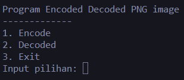
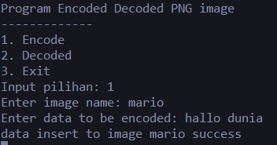
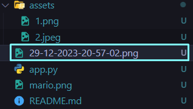
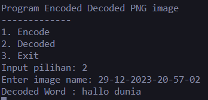

# Program Encoded & Decoded Message to PNG image

Program ini digunakan untuk melakukan **Encode** & **Decode** pesan kedalam **PNG image**

pada program ini terdapat 3 menu

1. Menu Encode

   - pada menu ini user akan diminta untuk melakukan input `gambar PNG` yang ingin diisikan pesan, setelah itu user akan diminta untuk `memasukan pesan yang ingin ditambahkan ke gambar`, setelah itu program akan memberikan output berupa `image PNG` yang b`erisi pesan` yang dimasukan tadi

     

     gambar diatas merupakan contoh dari proses encode program ini

     

     gambar diatas merupakan output dari proses encode program ini

2. Menu Decode

   - pada menu ini user akan diminta untuk memasukan `PNG image dari proses enconde tadi` agar user dapat melihat pesan yang terdapat dalam PNG image tadi.

     

     berikut merupakan contoh dan output pesan dari proses decode progam ini

3. Exit
   - menu ini digunakan jika user ingin keluar dari program
